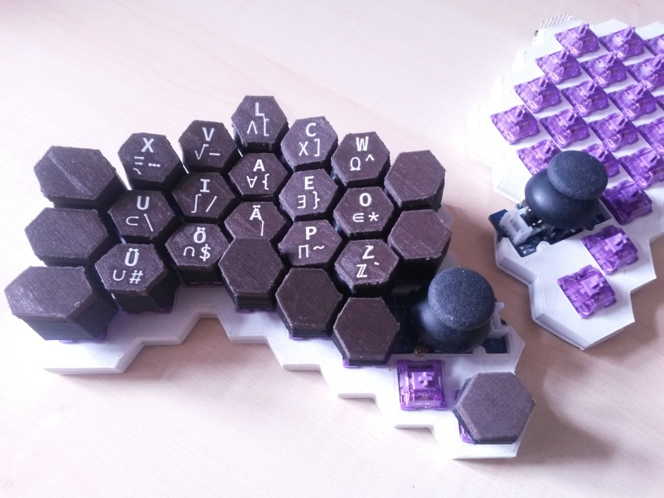

# Combwriter

Ergonomical Split-Typewriter with fully 3D-Printed Circuit Board and Hexagonal Keycaps

**Work-In-Progress Prototype**

## Features

* ergonomical split-layout
* hot-swappable, CherryMX compatible switches
* thumb joysticks for both hands
* 3D-printed hexagonal keycaps
* 3D-printed base-plate, including 3D-printed circuit board
* parametrized design:
  - customizable key-heights and angles ([layout.scad:21](https://github.com/michaelsippel/combwriter/blob/29c07f640cc59fc860c85ccadef08a7f6f34e77a/layout.scad#L21))
  - customizable key-symbols  ([layout.scad:35](https://github.com/michaelsippel/combwriter/blob/29c07f640cc59fc860c85ccadef08a7f6f34e77a/layout.scad#L35))

## Build it Yourself

### Materials

| Qty | Abstract                      |
|-----|-------------------------------|
| 50  | Diode (general purpose)       |
| 50  | CherryMX Compatible Switch    |
| 2   | Thumb Joystick                |
| 2   | 7x1 Pin-Header (2.54mm)       |
| 2   | 4x1 Pin-Header (2.54mm)       |
| 1   | Filament; PLA White           |
| 1   | Filament; PLA Black           |
| 1   | Filament; PLA Wood (optional) |
| 1   | Filament; TPU Conductive      |

## Donate XMR

    83SyrAeLemHR6cqAort2PgAvSq9dUSR5VWPtDecGFGUvJibR3QRkqNfUNQ1kiWuCXr25yss1NfpG4VpMcH8K85dt7ptfVHk

## License

[GPLv3](COPYING)
